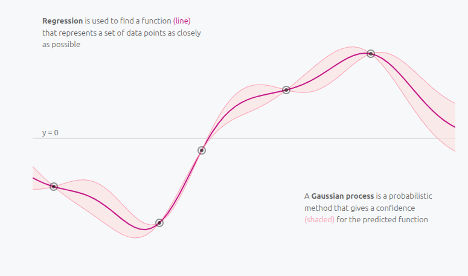
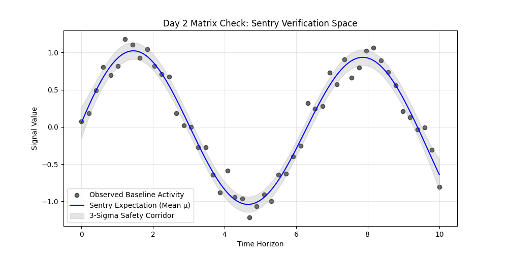
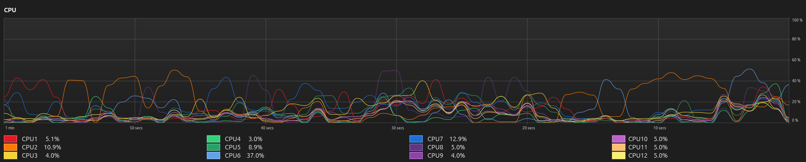
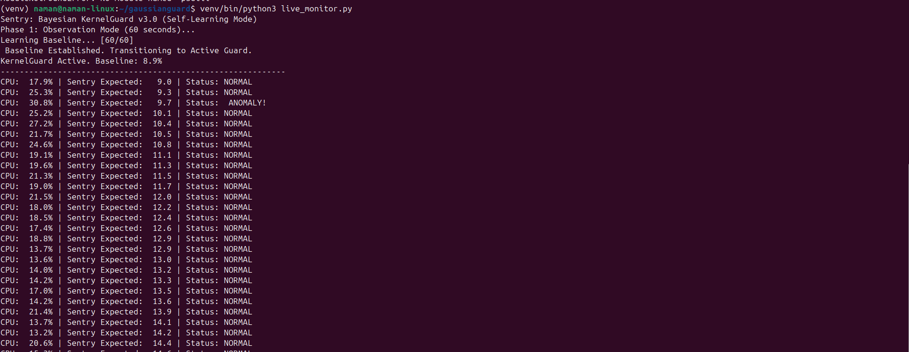

# Gaussian Guard

A Bayesian monitoring system that uses Gaussian Process Regression to construct adaptive safety corridors around time-series data. The engine learns the statistical manifold of a signal, establishes a probabilistic baseline, and flags observations that fall outside the expected variance as anomalies.

---

## Overview

Standard threshold-based monitors use static limits that fail to adapt to shifting workloads. This system replaces fixed thresholds with a probabilistic model: a Gaussian Process that continuously re-estimates the expected signal behavior and expresses its confidence as a 3-sigma safety corridor. Any observation outside this corridor is treated as a statistically non-stochastic event, not just a high number.

The architecture progresses through two stages: synthetic signal validation using a controlled sine wave, and live deployment against Linux CPU telemetry via a sliding window inference loop.

---

## Repository Structure

```
gaussianguard/
    core/
        sentry_engine.py        GP regression engine and kernel configuration
    examples/
        detector_demo.py        Synthetic signal validation and corridor visualization
    utils/
        signal_gen.py           Noisy sine wave generator for baseline testing
    live_monitor.py             Live CPU telemetry guard with sliding window inference
    requirements.txt
    README.md
    gp_verification.png         GP posterior fit over synthetic sine signal
    live_guard_terminal.png     Active guard terminal output with baseline calibration
    system_monitor.png          Linux system monitor showing per-core CPU activity
    distill_reference.png       Distill.pub GP reference
```

---

## Screenshots

### Reference: Gaussian Process Intuition

The conceptual foundation for this architecture. A Gaussian Process is a probabilistic method that produces a confidence region (shaded band) around a predicted function, not just a single line.



---

### GP Posterior Fit: Synthetic Verification

The GP correctly learns a smooth latent path through 60 noisy anchor points and reconstructs it at 200 prediction locations. The gray band is the 3-sigma safety corridor.



---

### System Monitor: Hardware Context

The guard tracks the system-wide average across all 12 cores. The per-core view below shows the raw utilization that feeds into the composite kernel.



---

## Mathematical Foundation

### The Kernel

The covariance between any two time points is defined by the Radial Basis Function:

$$k(x, x') = \sigma_f^2 \exp\left( -\frac{\|x - x'\|^2}{2l^2} \right)$$

- **Signal variance** controls the vertical extent of the probability boundary.
- **Length-scale** controls the temporal memory of the model, meaning how far back in time a point influences the current prediction.

### Predictive Inference

Given a new time point, the engine computes:

**Predictive mean:**

$$\mu_* = K_*^\top [K + \sigma_n^2 I]^{-1} y$$

**Predictive variance:**

```math
\sigma^2_{*} = K(X_{*}, X_{*}) - K_{*}^\top [K + \sigma_n^2 I]^{-1} K_{*}
```

The variance shrinks near training observations and expands in unobserved regions. The 3-sigma corridor covers 99.7% of the probability mass.

---

## Stage 1: Synthetic Signal Validation

The first stage validates the engine against a controlled sine wave with Gaussian noise. This confirms that the GP correctly reconstructs the latent path and draws a well-calibrated confidence corridor before any live data is introduced.

**Signal generator** (`utils/signal_gen.py`):

```python
import numpy as np

def generate_signal(n_samples=60, noise_level=0.15):
    np.random.seed(42)
    X = np.linspace(0, 10, n_samples).reshape(-1, 1)
    y_clean = np.sin(X).ravel()
    noise = np.random.normal(0, noise_level, n_samples)
    return X, y_clean + noise
```

**Sentry engine** (`core/sentry_engine.py`):

```python
from sklearn.gaussian_process import GaussianProcessRegressor
from sklearn.gaussian_process.kernels import RBF, ConstantKernel as C

class KernelSentry:
    def __init__(self, length_scale=1.0, noise_level=0.1):
        self.kernel = C(1.0, (1e-2, 1e2)) * RBF(
            length_scale=length_scale,
            length_scale_bounds=(1e-1, 1e2)
        )
        self.gp = GaussianProcessRegressor(
            kernel=self.kernel,
            alpha=noise_level**2,
            n_restarts_optimizer=10,
            random_state=42
        )

    def learn(self, X, y):
        self.gp.fit(X, y)

    def check_integrity(self, X_new):
        return self.gp.predict(X_new, return_std=True)
```

---

## Stage 2: Live CPU Telemetry

The second stage deploys the engine against live Linux system data. The model targets CPU utilization, sampled at 1-second intervals via `psutil`, and operates on a sliding 60-second window.

### Composite Kernel

CPU utilization has three structural components that a single RBF kernel cannot represent accurately:

| Component | Kernel | Purpose |
|---|---|---|
| Idle baseline offset | `ConstantKernel` | Handles non-zero floor (~6-12% on an idle machine) |
| Application load trend | `RBF` | Models smooth workload ramps as processes open and close |
| Interrupt jitter | `WhiteKernel` | Absorbs high-frequency noise so brief spikes are not flagged |

### Self-Calibration Period

The system runs a mandatory 60-second observation phase before activating anomaly detection. During this window it collects baseline telemetry and fits the initial model. Once calibration is complete, it enters active guard mode.

### Live Monitor (`live_monitor.py`):

```python
import psutil
import numpy as np
from sklearn.gaussian_process import GaussianProcessRegressor
from sklearn.gaussian_process.kernels import RBF, WhiteKernel, ConstantKernel

# Observation phase
history_x = np.atleast_2d(np.linspace(0, 59, 60)).T
history_y = []

while len(history_y) < 60:
    history_y.append(psutil.cpu_percent(interval=1))

history_y = np.array(history_y)
initial_baseline = np.mean(history_y)

kernel = ConstantKernel(constant_value=initial_baseline) \
       + 1.0 * RBF(length_scale=10.0) \
       + WhiteKernel(noise_level=1.0)

gp = GaussianProcessRegressor(kernel=kernel)

# Active guard loop
while True:
    current_usage = psutil.cpu_percent(interval=1)
    history_y = np.roll(history_y, -1)
    history_y[-1] = current_usage

    gp.fit(history_x, history_y)
    mu, sigma = gp.predict(np.atleast_2d([60]).T, return_std=True)

    upper = mu[0] + 3 * sigma[0]
    lower = mu[0] - 3 * sigma[0]

    status = "ANOMALY" if current_usage > upper or current_usage < lower else "NORMAL"
    print(f"CPU: {current_usage:5.1f}% | Expected: {mu[0]:5.1f} | Status: {status}")
```

### Observed Behavior

Tested on a 12-core Linux machine under normal and elevated workloads:

- Learned an initial idle baseline of 6.8% during calibration.
- When load climbed to 13.4% and then 19.6%, the model updated its expected mean without triggering false alarms; the workload shift was gradual enough to fall within the sliding window's learned trend.
- Designed to flag sudden non-correlated spikes that violate the probabilistic safety corridor.



---

## Key Design Decisions

**Online sliding window over batch retraining.** The GP is refitted every second on a fixed 60-point window rather than growing the dataset indefinitely. This keeps inference latency constant and ensures the model tracks current behavior rather than historical averages.

**Matrix dimensionality.** All time arrays are reshaped to `(-1, 1)` before being passed to the kernel. The linear algebra backend requires 2D column matrices for covariance matrix construction.

**Resolution asymmetry.** Training uses 60 anchor points. Prediction runs at 200 locations. This produces a smooth, high-resolution manifold without requiring dense training data.

**Hyperparameter optimization.** The RBF length-scale and signal variance are optimized by maximizing the log-marginal likelihood during `fit()`. No manual tuning is required after initial kernel selection.

---

## Installation and Usage

```bash
# Clone the repository
git clone https://github.com/thenamanshukla/gaussianguard.git
cd gaussianguard

# Create and activate virtual environment
python -m venv venv
source venv/bin/activate

# Install dependencies
pip install -r requirements.txt
```

**Run the synthetic validation:**

```bash
python examples/detector_demo.py
```

Output: `gp_verification.png` — the posterior fit over the noisy sine signal.

**Run the live CPU guard:**

```bash
python live_monitor.py
```

The terminal will display calibration progress for 60 seconds, then switch to live anomaly reporting.

---

## Requirements

```
numpy
scikit-learn
matplotlib
psutil
```

---

## References

Rasmussen, C. E., and Williams, C. K. I. *Gaussian Processes for Machine Learning*. MIT Press, 2006.

Distill.pub. *A Visual Exploration of Gaussian Processes*. 2019. https://distill.pub/2019/visual-exploration-gaussian-processes/
